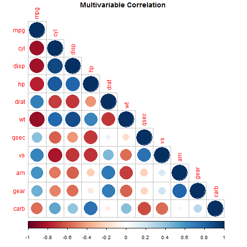
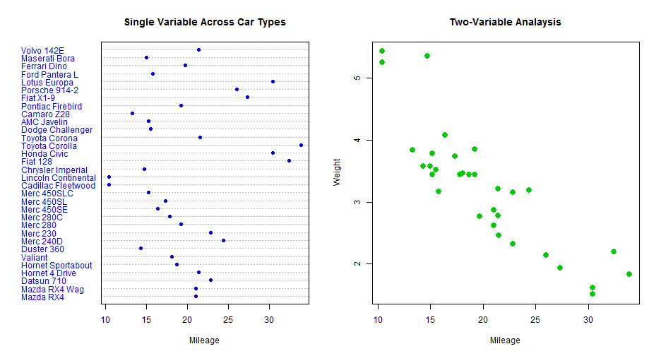

## Background & Features

<ol>
<li> An app is written using the shiny package in R.</li>
<li> The app serves to provide a visual understanding of the mtcars dataset.</li>
<li> Several different forms of visual representation are provided, including: </li>
<ul>
<li>  A visual correlation matrix of all variables in the dataset,</li>
<li>  visualization of the effect of a single variable across all car types,</li>
<li>  visualization of how two selected variables are correlated</li>
</ul>
<li> The app also provides linear regression models between two variables. </li>
</ol>

--- .class #id 

## Visual Representation of Data - Overview

A correlation matrix is provided to give an overview of variables in the dataset.

 

---

## Visual Representation of Data - Impact of Variables

Several different types of visualization are available in this shiny app, allowing the user to see a single variable across car types and the correlation between two variables.

 

---

## Source Codes and Supplementary Information

The source code for this project can be found at the following links:

- Github repository: https://github.com/xtrios/DDP
- Shiny app for mtcars visualization: http://xtrios.shinyapps.io/DDP-mtcars
- Location of Slidify deck: http://xtrios.github.io/slidify-deck/

Try out the app now at: https://github.com/xtrios/DDP!

